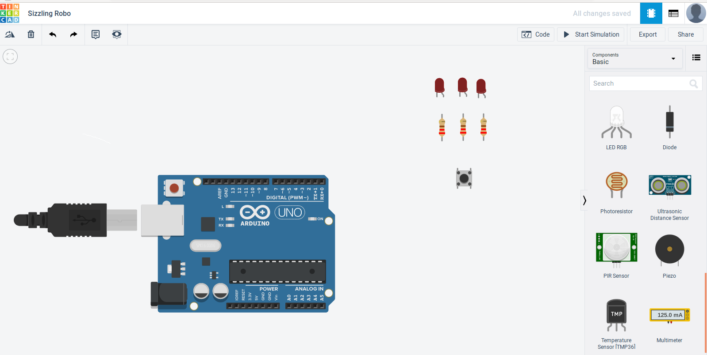
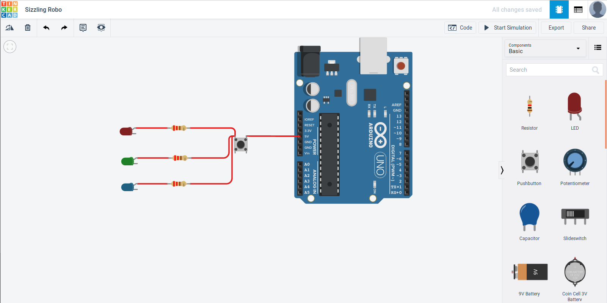
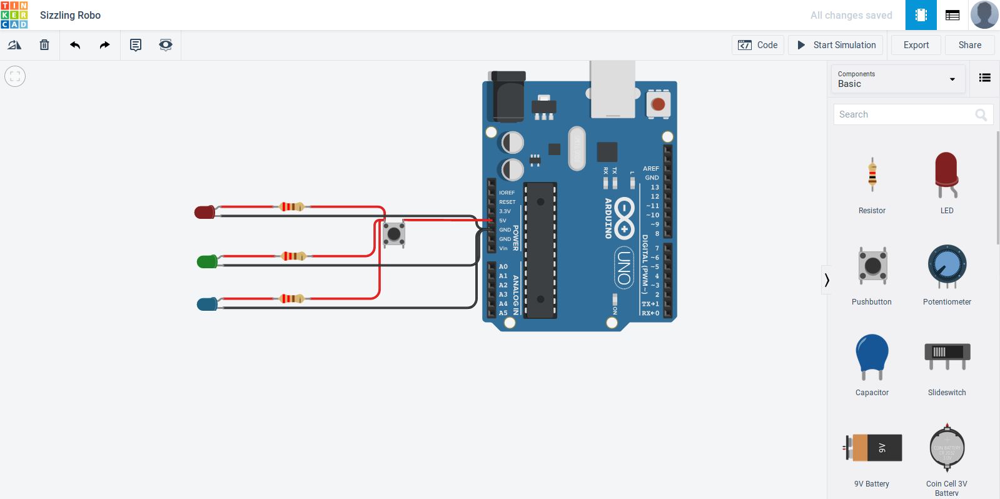
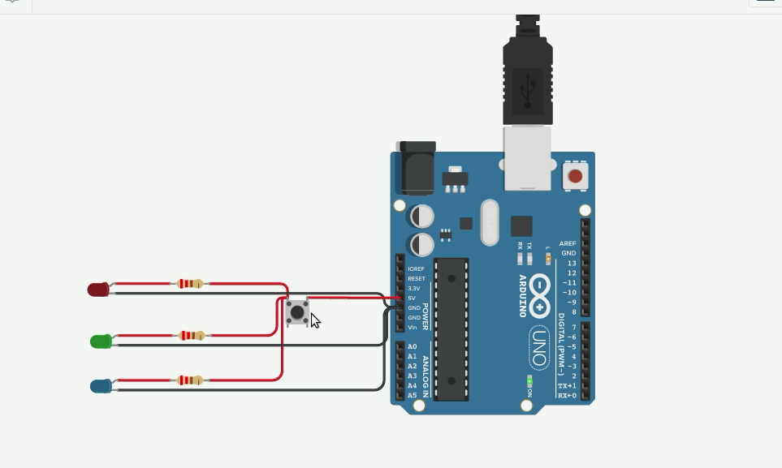

## Segunda atividade - Push Button
Nesta atividade iremos ligar um pequeno circuito eletrônico a partir do apertar de um botão.

Para essa atividade iremos usar os seguintes componentes da lista de componentes:

* 3 - Led's (qualquer cor)
* 3 - Resistor 220 Ohms
* 1 - Arduino Uno R3
* 1 - PushButton

Agora que todos os componentes estão na área de trabalho, vamos montar o circuito.

Neste circuito usaremos a saída de 5V do arduino, para vermos apenas o funcionamento do botão, mas se você colocar em um dos pinos digitais também irá funcionar, já que quando o valor do pino está em HIGH ele emite 5V.

O botão tem 4 terminais, 2 terminais 'A' e 2 terminais 'B', no circuito ligamos o 5V do Arduino ao terminal '2B' e a as leds ao terminal '1B'

Tanto os terminais '1A' e '1B' quanto '2A' e '2B' do botão são internamente ligados, ou seja se conectarmos os 5V ao terminal '1A' e depois as led's ao terminal '1B' ele irá ligar sem que haja o pressionar do botão.

E com isso, ligamos os GND's da led's a quaiquer GND no Arduino.

Pronto, o circuito está pronto para ser testado. Agora iniciamos a simulação e apertamos o botão :

Se o seu circuito funcionou perfeitamente, então pode seguir para as atividades :

## Atividades
* Fazer uma led piscar, enquanto o botão estiver ligado.
* Fazer o arduino mandar uma mensagem, no serial, quando um botão for pressionado.
